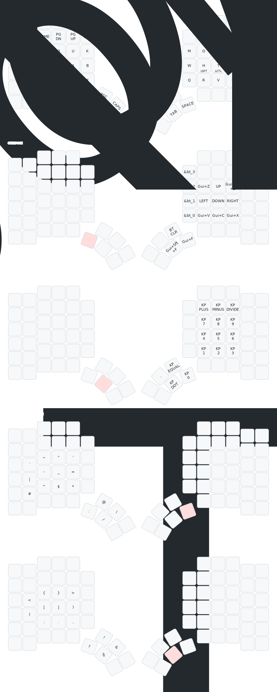

# VimGram - Glove80
A keyboard layout heavily inspired in Sunaku's "Glorious Engrammer" with a few modifications to ease the pinky load in Vim.

## Layout


## Usage
To install the dependencies:
```shell
uv sync
```

To build the firmware:
```shell
make firmware
```

To update the layout:
```shell
make diagram
```
